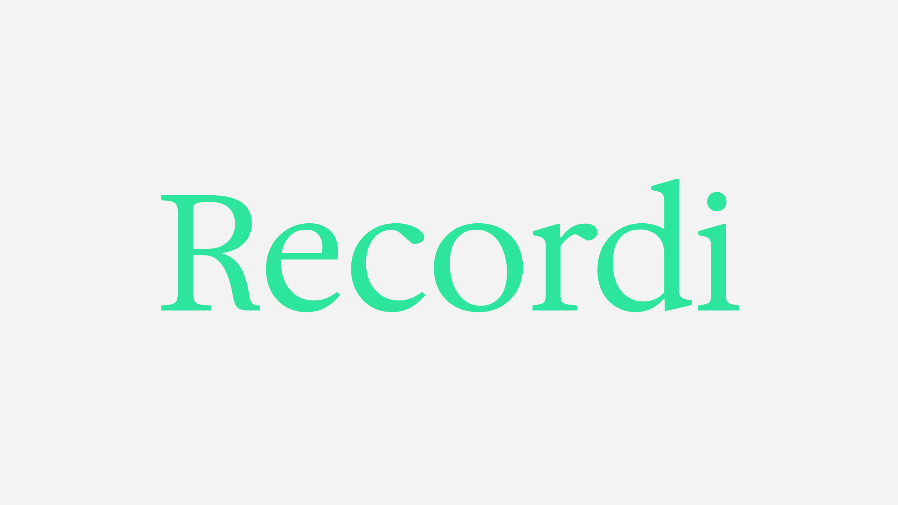

# Recordi
サービスURL：https://recordi.jp

### 思い出の記録・評価・共有ができるアプリ

# サービス概要
Recordi（レコルディ）とは、思い出の記録、1〜5個の星で思い出を評価、思い出を他のユーザーに共有するなどができるアプリです。 
思い出の記録だけでなく、場所、作品、料理などを記録しレビューアプリとして使用することもできます。

# サービス開発の背景
　休日に何もしないで１日が終わってしまったという日を誰しも経験していると思います。私もその一人で、休日に何かしようと考えるも結局何もせず無駄な１日を過ごしてしまうということがよくありました。今ではそういう日を無くそうと予定のない日はよく映画を観るようになり、映画を観るのが趣味になりましたが、たくさん映画を観るとこの日にこの作品を観たというのを忘れてしまうことがよくありました。 
　そこで私は、休日を無駄にしないで思い出を残して欲しいという思いから、観た映画や行った場所などを思い出として記録し、評価もつけられ、他の人と思い出を共有し合えるアプリ『Recordi』を開発することにしました。『Recordi』が、予定のない休日に何かしようと行動するきっかけの一つになれば良いなと考えております。

# 機能紹介

| ユーザー登録 / ログイン |
| :---: |
|  |
| 
『名前』『メールアドレス』『パスワード』『確認用パスワード』を入力してユーザー登録を行います。ユーザー登録後は、自動的にログイン処理が行われるようになっており、そのまま直ぐにサービスを利用する事が出来ます。 また、Googleアカウントを用いてGoogleログインを行う事も可能です。
 |
 

| カレンダー |
| :---: |
|  |
| 
カレンダーの日数をクリックすると、思い出記録フォームまたは思い出詳細ページに遷移することができます。
 |
 

| 思い出の記録 |
| :---: |
|  |
| 
必須項目の『日付』『タイトル』『本文』と、その他の項目の『評価』『メイン画像』『サブ画像』『タグ』を入力して思い出を記録できます。 また、メイン画像を追加しない場合、自動的にNo Image画像がメイン画像として追加されます。
 |
 

| 思い出一覧 |
| :---: |
|  |
| 
記録した思い出を一覧で閲覧できます。 また、「７ヶ月間の思い出の数を比較」をクリックすると、７ヶ月間の思い出の数を比較できるグラフが表示されます。
 |
 

| ポスト作成 |
| :---: |
|  |
| 
思い出を他のユーザーに共有する際にポストを作成します。『タイトル』『本文』『タグ』を入力してポストを作成できます。
 |
 

| ポスト一覧 |
| :---: |
|  |
| 
ポストを一覧で閲覧できます。また、ポストに『いいね』をすることができます。
 |
 

| リマインダー機能 |
| :---: |
|  |
| 
リマインダーメールの受信設定を行えます。受信設定をONにすると、土曜日または日曜日の朝に「今日は休日です、思い出を残しましょう」というメッセージをメールでリマインドすることができます。
 |
 

| プロフィール |
| :---: |
|  |
| 
プロフィールの確認・編集、作成したポスト・いいねしたポストの確認ができます。
 |
 

# 技術構成について

## 使用技術
| カテゴリ | 技術 |
| --- | --- | 
| フロントエンド | Ruby on Rails / JavaScript |
| バックエンド | Ruby 3.4.1 / Ruby on Rails 8.0.1 |
| CSSフレームワーク | Bootstrap / Font Awesome |
| データベース | PostgreSQL |
| 認証 | devise 4.9.4 |
| Web API | Google API |
| 環境構築 | Docker |
| インフラ | Fly.io / Amazon S3 |
| CI/CD | Github Actions |
 

## ER図

 

## 画面遷移図
Figma：https://www.figma.com/design/q4G7Nwu8Wyb56KLD9ks0TM/recollection_calendar_app?node-id=0-1&p=f&t=CC89fp5GsBNClTqM-0
 